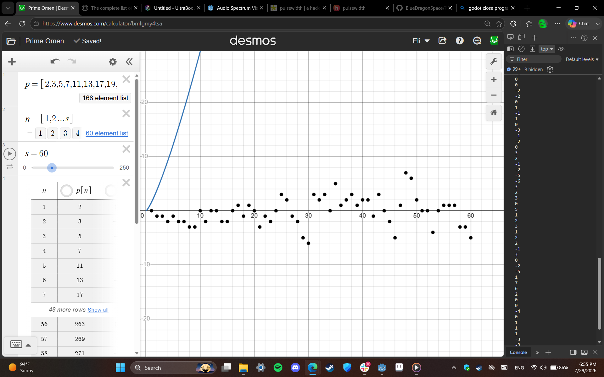

doo doot doo...

(Reimagining [this Desmos Graph](https://www.desmos.com/calculator/bmfgmy4tsa) as music)

7/29/2026:
The basic idea - Have Desmos try to predict what the next prime number is using a regression line, and then turn those into musical notes.
Using Godot for the main codebase of the project, Desmos Graphing for the placement of notes, Ultrabox for the individual note sound effects, [this](https://www.math.uchicago.edu/~luis/allprimes.html) funny little website that has a list of all primes, and a strange JavaScript script I found on Reddit (of all places) to rip the Desmos array into plaintext so I can copypaste it into Godot.
Initially used pitch-shifting for the sounds, and realized it sounded terrible, so now I have like 30 sound effect files, with hopefully a better result.

6:55PM:  
	First audio clip! I had done this in Jummbox by hand a while back, never thought to put in it Godot to automate it til now tho
  kinda haunting knowing how much it sounds like it has a pattern, when there isn't really... it's strange
 
 8PM: You know, this reminds me of the
[Egg Song](https://www.youtube.com/watch?v=JvAjtd8jhZc)
from Animal Well...

  
7/30: Fixed an error where the first note wouldn't be visualized, and made two different sound visualizers. One I uhhhhh... "imported" (mostly copypasted, it's under MIT License) from a [Godot Asset Demo](https://godotengine.org/asset-library/asset/2762). The other is made by hand, and shows the notes going from left to right. Currently has goofy placeholder art.

  
8/1: Fixed an error where consecutive notes wouldn't visualize on the piano roll, messed around a little bit too much with the button themes, and replaced the placeholder art. Tbh, all of the technically challenging stuff that I wanted to do with this project is done already, I don't have a lot of other things I want to do with it...
 Later: Added a progress bar, credits, song selector, reorganized files, 
