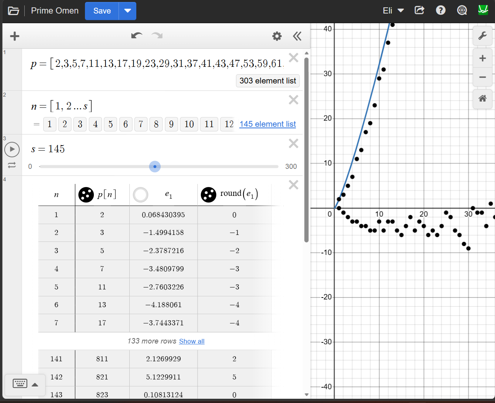
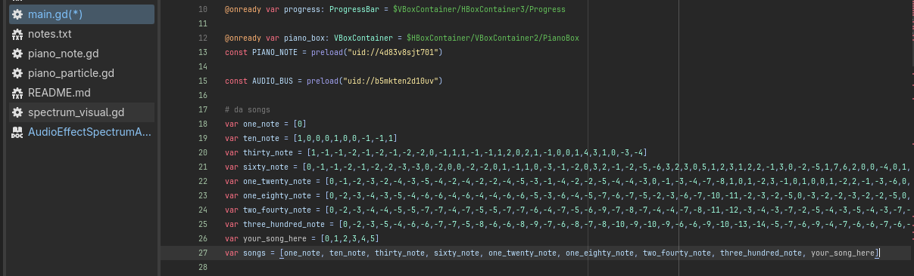

Try it here!: [Prime Omen Player](https://file.garden/ZvYk8SE050beWacV/PrimeOmen2/index.html)

.png)

Small project that translates Desmos Regression Line Residuals (or really, any integer array input, now that I think about it...) into music!
Made as part of Hack Club's [pulsewidth](https://pulsewidth.hackclub.com/) event.

<h1>How it Works</h1>
Prime numbers have always had a strange, unpredictable pattern that no mathematician (even today!) has truly figured out. All this program really does is try to exploit that pattern and turn it into music.

First, I got an exceptionally long list of prime numbers from an [academic-looking website](https://www.math.uchicago.edu/~luis/allprimes.html), and pasted it into an array on a [custom Desmos graph](https://www.desmos.com/calculator/bmfgmy4tsa). In the graph: (add a screenshot!) <br>

<br> "p" is the list of primes,
<br> "n" is a dummy array that simply lists every integer from 1 to however many notes I want,
<br> and "s" is how many notes I want.
<br> <br> From there, Desmos takes these numbers, crunches a few calculations, and tries to give a pattern to the primes, which is the black line. However, this graph is wrong, so Desmos also calculates how wrong it is, which is called it's <b>residual</b>. If you've never heard of residuals in math before, imagine it as how far away each individual value (every prime) is from its estimate on the graph.

<br> "e_1" is the list of all residuals,
<br> "g" is the same thing as "e_1", but all the numbers are rounded instead (since music sounds nicer when you aren't trying to play a piano key 3.381 notes from middle C)
<br> <br> This "g" is now the array that I turn into music in Godot! Every time a "0" is read from this array, middle C (or the middle-most note of a piano) is played. Middle C is shown as the blue note in Godot. For however much higher or lower the next number from the array is, the corresponding note is that far from middle C. For example, if an "3" is read from the array, the note that plays is 3 notes up from middle C.
.png)
<br> And that's pretty much it really lol

<h1>How to add your own Prime Omen!</h1>
Adding one note to a Prime Omen changes the entire song! Unfortunately, I don't have a quick way to automate this so adding one note involves quite a few steps.
<br><br> The first step is to decide on how many notes you want in your Prime Omen, and change the value "s" in the [aforementioned Desmos graph](https://www.desmos.com/calculator/bmfgmy4tsa). Make sure the number is bigger than 1. If it's bigger than 303, you'll need to add more primes to the "p" array using [aforementioned academic website](https://www.math.uchicago.edu/~luis/allprimes.html), because I only ever added the first 303 primes to the graph. From here Desmos does all the work and all you have to do is copy the residuals.
<br><br> Now, strangely, Desmos doesn't allow copying data from it's website, so we need to tell the console to extract it as plaintext. I'm on Windows, so to get to the console I use ctrl+shift+I (for inspect), and navigate to Console (add a screenshot!). Next I copy+paste the below command in (all it does is print the lowest line's contents): 

```
state = Calc.getState()

expressionToEvaluate = state.expressions.list[state.expressions.list.length-1].latex

expressionResult = Calc.HelperExpression({latex: expressionToEvaluate})

while(expressionResult.listValue == null){
	console.log(expressionResult.listValue)
	await new Promise(r => setTimeout(r, 100));
}
//await new Promise(r => setTimeout(r, 2000));

resultString = ""
for (i=0; i<expressionResult.listValue.length; i++) {
	resultString += expressionResult.listValue[i] + ","
}
console.log(resultString)
```
<br>You should now be able to copy and paste your notes into Godot. In Godot, make a new array in the "main.gd" script, then put that array at the end of the "songs" array.  

<br> After that navigate to the SongList node in the SceneTree on the left, go to the "Items" property, hit the right button to go to the end of the array, press "Add Element", and put the name of your song in the new "Text" property you just created.
<br> And you're done! Locally you'll be able to play your song under the dropdown menu.
